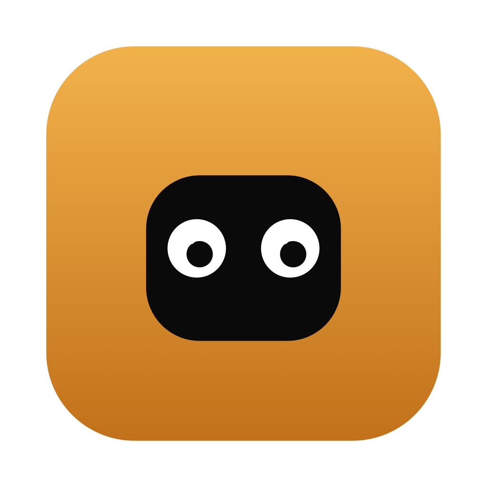

<p align="center">
  
</p>

<h1 align="center">Cubby</h1>

> A little creature that lives in your Mac's notch. Drop files on it, control your music, and glance at what matters — right from the black bar at the top of your screen.

Cubby turns the notch (or a small strip at the top of any Mac) into a **shelf**: hover to peek, click to open, drag a file onto it to stash it. It's a free, open-source, single-purpose take on the "notch hub" idea — no account, no daemon, no dependencies.

*Screenshots coming soon.*

## Features

- **Files** — drag any file onto the notch and it lands on a shelf; drag it back out wherever you need it.
- **Music** — control Apple Music from the notch: play/pause, skip, scrub, artwork.
- **Pomodoro** — a focus timer with adjustable durations. When a phase ends, the notch opens by itself on the countdown; the next one starts when you say so. Install it from the Marketplace in Settings.
- **Side pins** — when closed, the notch shows a Dynamic Island-style widget: now playing, or a running countdown. Pin a tab manually, or let Cubby auto-pick.

## Requirements

- macOS 14 (Sonoma) or later. A notched Mac is ideal; on other Macs, Cubby falls back to a small strip at the top-center of the screen.
- The **Swift 6 toolchain** (Xcode 16 or later) to build.
- The **Apple Music** app, for the Music tab.

## Install

```sh
git clone https://github.com/ndaen/cubby-mac.git
cd cubby-mac
bash build-app.sh          # builds and installs /Applications/Cubby.app
open /Applications/Cubby.app
```

Cubby is an **agent app**: no Dock icon, it lives in the menu bar (a small face) and on the notch.

### Gatekeeper

Cubby is **ad-hoc signed and not notarized**, so macOS blocks it on first launch (*"Apple could not verify…"*). To open it: drag Cubby into **Applications**, then open **System Settings › Privacy & Security**, scroll to the bottom and click **Open Anyway** next to the Cubby message. *(On macOS 14 you can instead right-click `Cubby.app` › **Open**.)* Or from Terminal:

```sh
xattr -dr com.apple.quarantine /Applications/Cubby.app
```

### Launch at login

```sh
bash autostart.sh on       # start Cubby at every login
bash autostart.sh off      # stop
```

## Permissions

The first time you use the **Music** tab, macOS asks you to let Cubby control Apple Music (Apple Events). That is the only permission Cubby requests. No accessibility permission is needed — mouse tracking uses a global monitor that doesn't require it.

## Development

```sh
swift build                # debug build
swift run                  # build & run from the terminal
swift test                 # run the test suite
```

Cubby is **SwiftUI + AppKit**, built with **Swift Package Manager**, with **zero third-party runtime dependencies**. The notch window, shape, and shell state machine are adapted from [NotchDrop](https://github.com/Lakr233/NotchDrop) (MIT).

## Roadmap

- **More extensions** — Pomodoro is the first one shipped through the Marketplace; Weather and Agenda are next.
- **Spotify** alongside Apple Music.
- Notarized, auto-updating builds — Cubby is currently ad-hoc signed, so the first launch needs a trip through System Settings.

## Contributing

Issues and pull requests are welcome. Build with `swift build` before submitting.

## License

MIT — see [LICENSE](LICENSE). Cubby includes code adapted from NotchDrop (MIT); its notice is reproduced in [THIRD-PARTY-NOTICES.md](THIRD-PARTY-NOTICES.md).

---

*Why "Cubby"? The notch is a little cubby-hole at the top of your screen. Cubby is who lives in it.*
